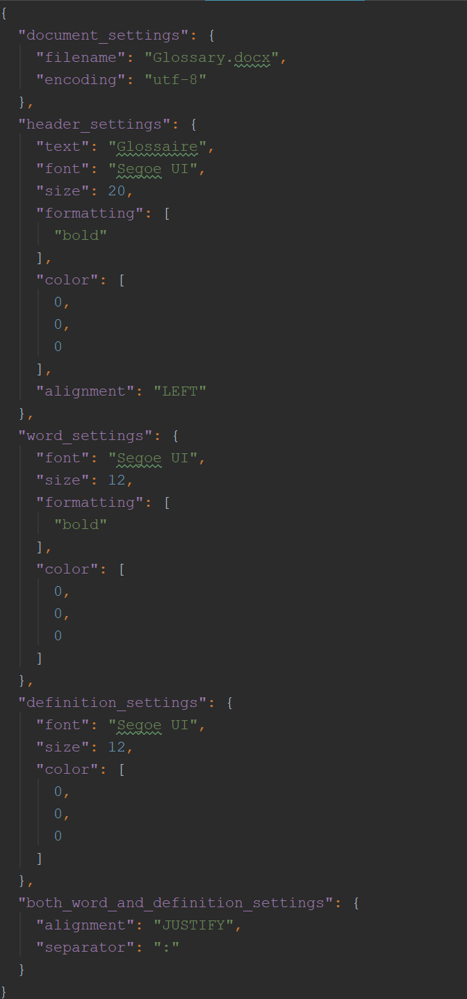
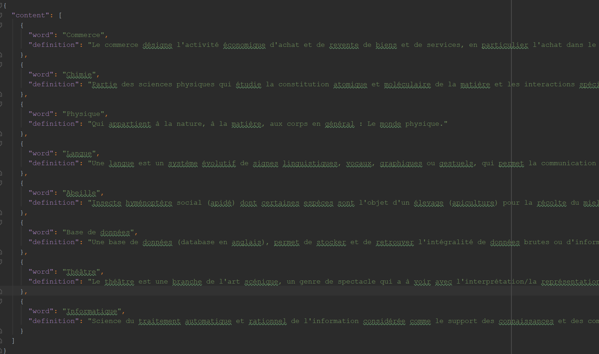
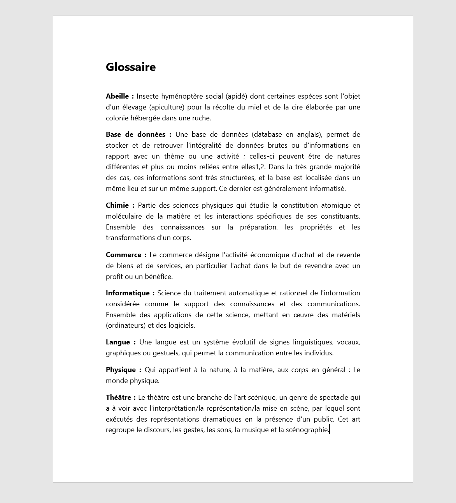

# DocxGlossaryGen
A customizable tool that generates an alphabetically sorted glossary in docx.

## Why 
This projet has been made after having ended the writing process of a book of specifications (french "Cahier des charges").

I noticed that writing a glossary can be painful when dealing with a lot of words to define, which are not automatically
alphabetically sorted (although Word may have secret functionalities I don't know!).

Thus, developing a fairly simple tool to ease this process came to my mind, and voilà!

## Example

Settings file

Content file

Result, the definitions were taken from Google definition feature "Define [word]"

## Dependencies
This tool will not work if you do not setup  (one pip line, it's ok) :

    python-docx
    
  It's a powerful package that allows Word documents manipulation. 
  More about it here : <a href="https://github.com/python-openxml/python-docx">python-docx github repo</a>  
  And also here : <a href="https://python-docx.readthedocs.io/en/latest/">python-docx documentation</a>
  

## What it does 
This tool relies on two files:
  
    \settings.json
It holds settings regarding the file properties, the text formatting and customization

----------

	\content.json
It holds the list of definitions which will be inserted in the final docx file

   ----------

Once completed correctly, the python script translates those two JSON structures into a new (or it overrides directly) docx file 
easy to integrate within another.    
   
## How to use 

If you wish to keep the default file formatting and text customization, do not modify the **settings** file, simply put all of your definitions in the **content** file.

Here is what you can modify :

**TODO** sorry, :(   
Take a look at the two JSON files, it's fairly easy to understand and manipulate :D
I will complete this section 

## Warning

This projet has been made in a very short time and for a personal purpose, hence it does not provide :
- Full Microsoft Word customizing options
- Null checks / File verifications / Value checks 
- Extensible settings file (**you can NOT add or remove a key-value pair, you can ONLY modify the existing ones**)

As a consequence, trying to modify the JSON structure of both files on which this tool rely may lead to improper behaviour, which I'm not responsible for :) 

## Contribute

A lot could be done for this small though useful project, and you can be a part of it. Here is what you can do:
- Tell me about functionalities you would like to see.
- Make PRs and open issues, which I will review and take into the project.
- What about a simple GUI with Tkinter ? 

## Thanks

To the creator(s) and contributors of python-docx, without whom this project would not have been possible.
