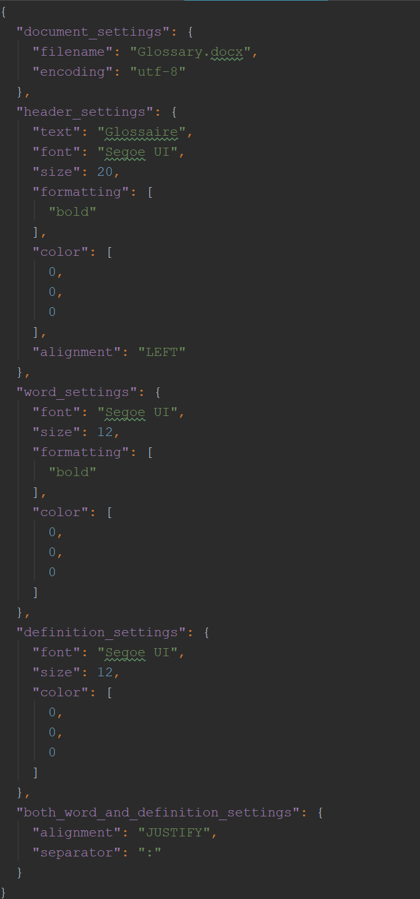
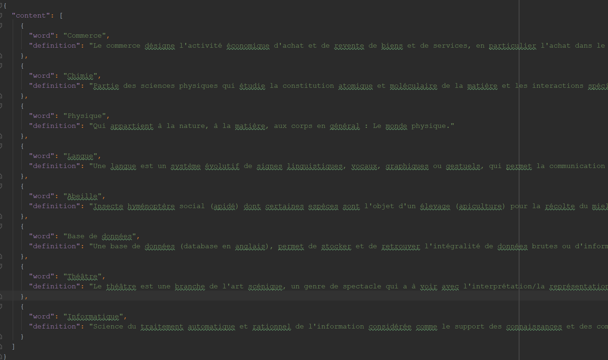
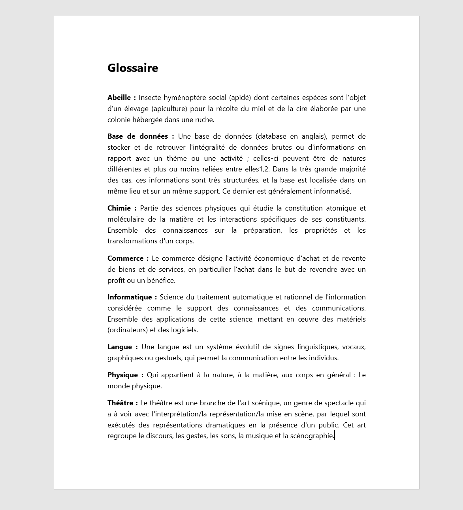

# DocxGlossaryGen
A customizable tool that generates an alphabetically sorted glossary in docx.

## Why 
This projet has been made after having ended the writing process of a book of specifications (french "Cahier des charges").

I noticed that writing a glossary can be painful when dealing with a lot of words to define, which are not automatically
alphabetically sorted (although Word may have secret functionalities I don't know!).

Thus, developing a fairly simple tool to ease this process came to my mind, and voilà!

## Example

Settings file

Content file

Result, the definitions were taken from Google definition feature "Define [word]"

## Dependencies
This tool will not work if you do not setup  (one pip line, it's ok) :

    python-docx
    
  It's a powerful package that allows Word documents manipulation. 
  More about it here : <a href="https://github.com/python-openxml/python-docx">python-docx github repo</a>  
  And also here : <a href="https://python-docx.readthedocs.io/en/latest/">python-docx documentation</a>
  

## What it does 
This tool relies on two files:
  
    \settings.json
It holds settings regarding the file properties, the text formatting and customization

----------

	\content.json
It holds the list of definitions which will be inserted in the final docx file

   ----------

Once completed correctly, the python script translates those two JSON structures into a new (or it overrides directly) docx file 
easy to integrate within another.    
   
## How to use 

If you wish to keep the default file formatting and text customization, do not modify the **settings** file, simply put all of your definitions in the **content** file and start **DocxGlossaryGen.py**.

   ----------

The definitions are simply organized into a list of key-value pairs.
A new word is defined with the following code in **content.json** :  

	{
	    "word" : "The word you want to define",
	    "definition" : "The actual definition of this word"
    }
If you want to add a new definition, you simply have to type (copy/paste) those two lines in the "content" array of content.json

   ----------

Here is what you can modify in the settings (**DO NOT REMOVE OR ADD ANY KEY-VALUE PAIR**, see *warning* section :

|  section | parameter| explanation | default / possible value |
|---|---|---|---|
|documment_settings| | | |
|   | filename   | Name of the Docx file to generate / override by default  | "Glossary.docx" / Any valid file path  |
|   | encoding   | Encoding of the characters shown in the geneated file  | "utf-8" / Any valid encoding   |
|header_settings| | | |
|   | text | Text shown in the upper header  | "Glossary" / "RandomString |
|   | size  | Size, in **pts** of the header text  | 20 / int > 0 |
|   | font |  Header's font name, string value, no file path | "Arial" / "Segoe UI Bold", Any font name |
|   | color  | Text color, array of RGB components, integers  | [ 0 , 0 , 0 ] / [ 255 , 255 , 255 ]| |
|   | formatting  | Array of text formatting options, strings  | ['bold'] / Any of ['bold','italic', rtfm] |
|   | alignment  | Alignment of the header text  | "LEFT" / any of "LEFT", "RIGHT", "CENTER","JUSTIFY", "DISTRIBUTE"|
|word_settings | |  | |
|   | size  | Size, in **pts** of each word being defined | 12 / int > 0 |
|   | font |  Word's font name, string value, no file path | "Arial" / "Segoe UI Bold", any font name |
|   | color  | Array of RGB components, integers  | [ 0 , 0 , 0 ] / [ 255 , 255 , 255 ]| |
|   | formatting  | Array of text formatting options, strings  | ['bold'] / Any of ['bold','italic', rtfm] |
|definition_settings | | | |
|   | size  | Size, in **pts** of each definition coming after its associated word| 12 / int > 0 |
|   | font |  Definition's font name, string value, no file path | "Arial" / "Segoe UI", Any font name |
|   | color  | Text color, Array of RGB components, integers  | [ 0 , 0 , 0 ] / [ 255 , 255 , 255 ]| |
|both_word_and_definition_settings | | | |
| | alignment | Alignment of the whole paragraph containing a word and its definition| "JUSTIFY" / Any of "LEFT", "RIGHT", "CENTER","JUSTIFY", "DISTRIBUTE"| |
| | separator | The separator placed between a word and its definition | " : " / " - " ,any string|

   ----------

Look at

	\example
to clarify anything. You'll find default values changed and a **content.json** ready-to-use.  
Look at

    \project
for a clean setup. **content.json** is almost empty and all the settings have their default value.

## Warning

This project has been made in a very short time and for a personal purpose, hence it does not provide :
- Full Microsoft Word customizing options
- Null checks / File verifications / Value checks
- Extensible settings file (**you can NOT add or remove a key-value pair, you can ONLY modify the existing ones**)

As a consequence, trying to modify the JSON structure of both files on which this tool rely, aswell as using wrong values may lead to improper behaviour, which I'm not responsible for :)

## Contribute

A lot could be done for this small though useful project, and you can be a part of it. Here is what you can do:
- Tell me about functionalities you would like to see.
- Make PRs and open issues, which I will review and take into the project.
- What about a simple GUI with Tkinter ? 

## Thanks

To the creator(s) and contributors of python-docx, without whom this project would not have been possible.
